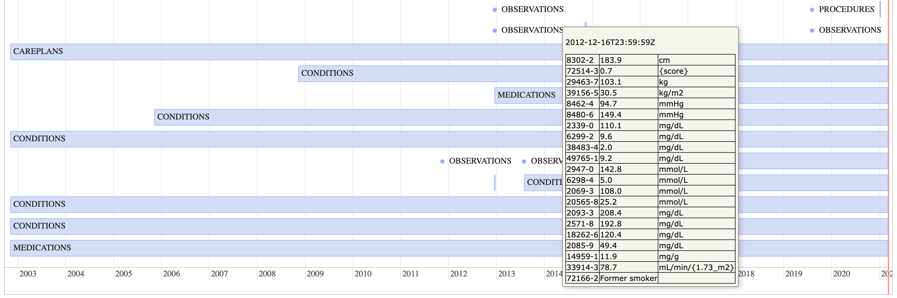
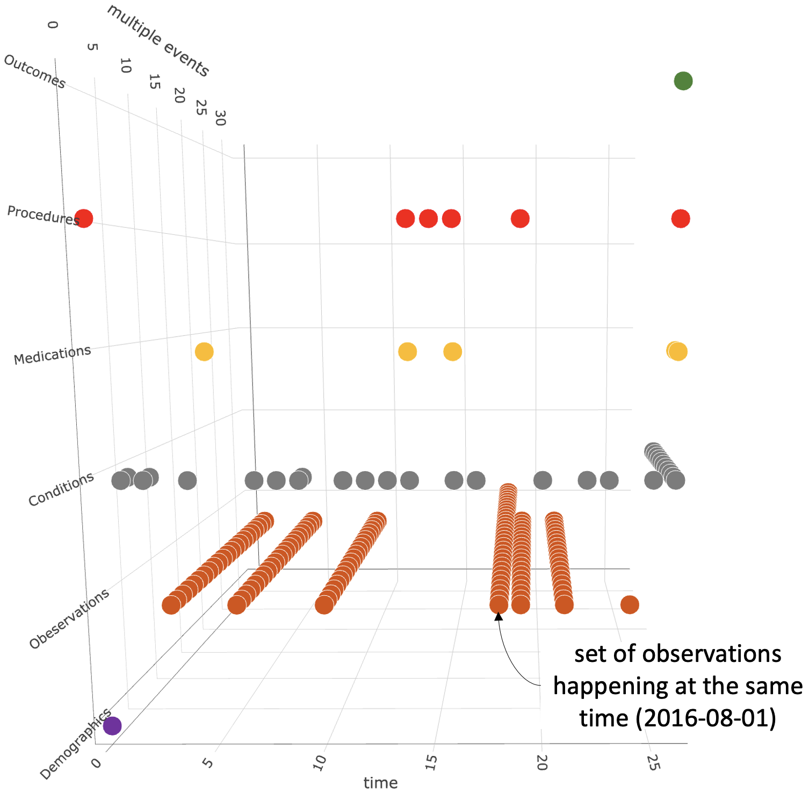
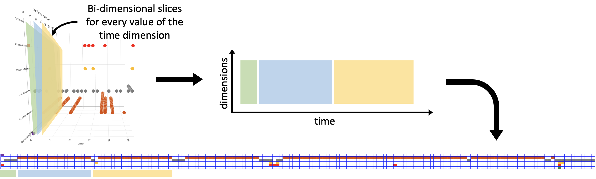
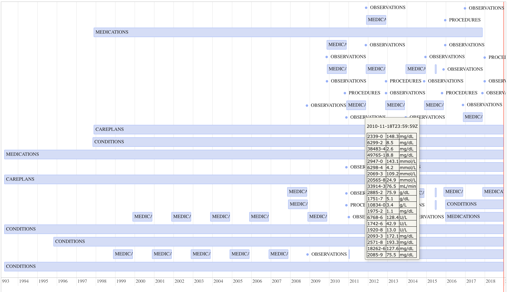
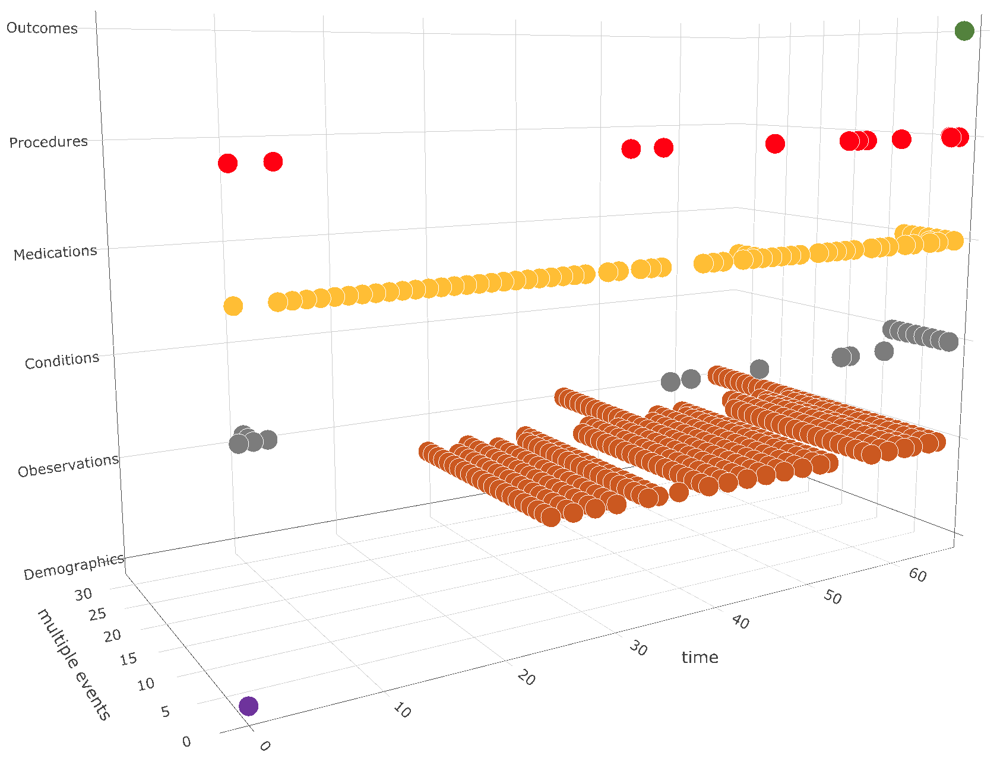
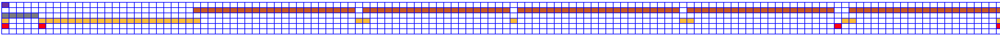
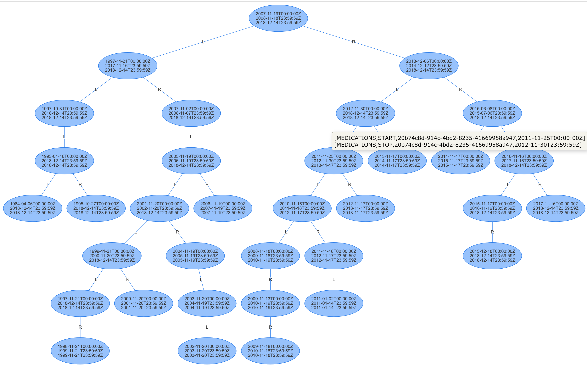
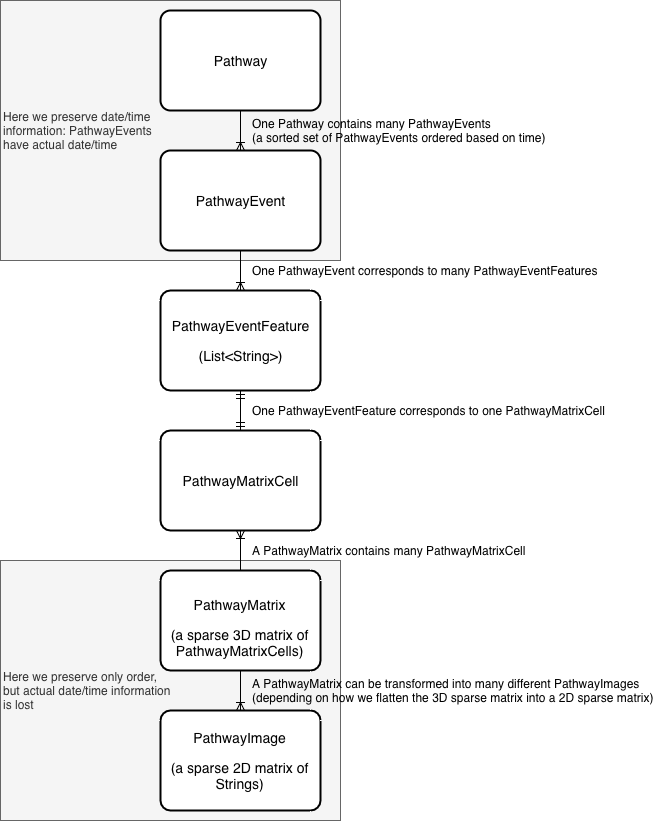

# Introduction

Segen's Medical Dictionary proposes the following definition of patient pathway:

> Patient Pathway: The route that a patient follows from the first contact with an NHS member of staff (typically his or her  GP) through referral to the completion of treatment. The pathway also covers the period from entry into a hospital, or a treatment centre until discharge. It is a timeline on which every event relating to treatment can be entered, including consultations, diagnosis, treatment, medication, diet, assessment, teaching and preparing for discharge from hospital. The pathway provides an outline of the events likely to happen on the patient's journey and can be used both to inform the patient as well as to plan services as a template for common services and operations.
> 
> &mdash; <cite>"patient pathway." Segen's Medical Dictionary. 2011. Farlex, Inc. 18 Jun. 2021 https://medical-dictionary.thefreedictionary.com/patient+pathway<cite>

We classify pathway events and data along a set of predefined classes, and we represent their discretized values in a structured representation that encodes time. Our _pathway extractor_ takes as input  CSV or NDJSON data in the format of that generated by [Synthea](https://github.com/synthetichealth/synthea), and encodes the patient data into our pathway representation. More precisely, we consider the following classes from data generated by Synthea: _demographics_ (patient details), _observations_ (results of clinical exams and vitals), _conditions_ (diagnoses and care plans), _medications_, _procedures_ and _outcomes_ (readmission, death, survival at point in time). Some data consist of isolated events (they occur at a specific point in time), others instead have a duration. The following figure is a representation of patient pathway as timeline: isolated events are shown as dots, and events with duration are represented as horizontal bars; the pathway includes several conditions, and it shows details of a set of observations happening at the same time (2016-08-01).


*Longitudinal timeline representation of a pathway*

The timeline representation of a pathway is easily understandable by humans, but it is not effective for automated analysis with machine learning or deep learning. For this reason we use the pathway extractor to produce an image-like representation of the pathway data. The process for building our image-like representation of a pathway consists of three steps:

1. mapping of the data points in a 3-dimensional grid 
2. flattening into a bi-dimensional grid 
3. numerical encoding.

As a first step, we discretize all the values, and we arrange them in a 3-dimensional grid, where the first dimension gives the order of the events (time), the second dimension spans the different classes in our representation (i.e. demographics, observations, conditions, medications, procedures, and outcomes), and the third dimension represents concurrence of events (data points of a certain class that happen at the same time). The following figure shows the three-dimensional grid representation of the pathway timeline shown above.


*Three dimensional grid representation of pathway*

Note that along the time dimension we retain the order of events, but we do not encode their corresponding dates (although this would be possible with a relatively simple extension of the representation). We discretize values using a set of configurable rules that group values into custom bins. The rules are defined using spreadsheets that are easily interpretable by practitioners, and are parsed and executed using the [Drools](https://www.drools.org/) rule engine. We currently have 246 rules, covering demographics, medications dispenses, observations (based on age and gender of the patient, the [LOINC](https://loinc.org/) code of the medication and its units), and outcomes.

As a second step, we flatten the three-dimensional grid into a bi-dimensional grid where the horizontal axis represents the order of events, and the vertical axis represents the different classes in our representation. Multiple concurrent data points having the same class are placed one after the other along the horizontal axis. In other words, we compute different bi-dimensional slices for every value of the time dimension, then we rotate those slices along the class dimension, and we concatenate them as shown in the following figure.


*From the three-dimensional grid representation to the final bi-dimensional grid representation of pathway*

Finally, we encode the values of the bi-dimensional grid in a numeric space  (typically the set &reals; of real numbers, but it can also be the set &#8469; of natural numbers, depending on the downstream analysis task; in some experiment we encode values in the RGB space, so that the final representation can be visualized as an image). This effectively produces a numeric representation of the patient pathway that encodes discretized values along distinct dimensions and time, and that is easily amenable to machine learning and deep learning tasks: for an example application see the following [article](https://arxiv.org/abs/2103.14161): <cite>Nguyen-Duc, T., Natasha Mulligan, G. Mannu and J. Bettencourt-Silva. “Deep EHR Spotlight: a Framework and Mechanism to Highlight Events in Electronic Health Records for Explainable Predictions.” AMIA 2021 Virtual Informatics Summit (2021)</cite>.
> 
> 

# Pathway Extractor

The Pathway Extractor is a stand-alone Java application (built with [Spring Boot](http://spring.io/projects/spring-boot)) to extract pathway images from patient data. It is currently designed to work with patient data generated by [Synthea](https://github.com/synthetichealth/synthea) (both CSV and FHIR NDJSON formats), but it can be extended to other patient data formats (More specifically, the current version is designed to process patient data generated by the Synthea code with commit id `a3482c856d30410e438047845796095a827cca41`.)

## How to build

From the command line, go to the main project folder, and run `./mvnw clean package`. This will package the app into a single jar in the `target/` directory.

## How to configure

All configuration is done using properties in the file `application.properties`. The following is an example:

```
com.ibm.research.drl.deepguidelines.pathways.extractor.input.data.format=SYNTHEA_CSV
com.ibm.research.drl.deepguidelines.pathways.extractor.input.data.path=/Users/marco/a/50k_patients_seed_3/csv/
com.ibm.research.drl.deepguidelines.pathways.extractor.input.data.split.to.path=
com.ibm.research.drl.deepguidelines.pathways.extractor.input.data.split.max.number.of.patients.per.chunk=
com.ibm.research.drl.deepguidelines.pathways.extractor.input.included.medical.types=OBSERVATIONS, IMAGING_STUDIES, ALLERGIES, CONDITIONS, MEDICATIONS, PROCEDURES, CAREPLANS
com.ibm.research.drl.deepguidelines.pathways.extractor.input.included.conditions.codes=53741008, 74400008, 49436004, 44054006, 22298006, 230690007, 410429000, 65966004, 431855005, 126906006 
com.ibm.research.drl.deepguidelines.pathways.extractor.output.produce.javascript.data.for.visualizations.for.patient.with.ids=0007782f-ca96-4ad1-bdf7-516ab5dc1ef5, 00ab992b-f309-444e-abd4-191cd7fd97e5, 00073f65-c57e-42c9-88e4-8a4e0e3b9457
com.ibm.research.drl.deepguidelines.pathways.extractor.output.PathwayImagesWriter=NIO
com.ibm.research.drl.deepguidelines.pathways.extractor.output.path=/Users/marco/a/pathways_images/
com.ibm.research.drl.deepguidelines.pathways.extractor.output.max.output.file.size.in.bytes=
com.ibm.research.drl.deepguidelines.pathways.extractor.output.pathway.image.max.columns=400
com.ibm.research.drl.deepguidelines.pathways.extractor.output.pathway.image.without.pathway.event.features.from.start.and.stop.pathway.events=true
```

- `com.ibm.research.drl.deepguidelines.pathways.extractor.input.data.format` specifies the format of the input data. Valid values for this property are `SYNTHEA_CSV` and `FHIR_NDJSON`.
- `com.ibm.research.drl.deepguidelines.pathways.extractor.input.data.path` defines the input folder containing the data set for which you want to extract the pathway images. It is expected that this input folder will contain one file for each medical type specified in the `com.ibm.research.drl.deepguidelines.pathways.extractor.input.included.medical.types` property, as well as a file containing patient demographic data.
- `com.ibm.research.drl.deepguidelines.pathways.extractor.input.data.split.to.path` if the input data set is too big to be processed (for example 0.5 million patients), you can tell Pathway Extractor to split the input data set into smaller data sets, which will then be processed individually. This properties specifies a folder where the Pathway Extractor can write the smaller data sets created by splitting the input data set.
- `com.ibm.research.drl.deepguidelines.pathways.extractor.input.data.split.max.number.of.patients.per.chunk`. If the `com.ibm.research.drl.deepguidelines.pathways.extractor.input.data.split.to.path` property is not empty, this property specifies the maximum number of patients to be contained in the smaller data sets created by splitting the input data set. It must be a positive integer value. If you leave either this property or the `com.ibm.research.drl.deepguidelines.pathways.extractor.input.data.split.to.path` property empty, the input data set will not be split.
- `com.ibm.research.drl.deepguidelines.pathways.extractor.input.included.medical.types` defines the list of medical types that you want to include as data. The medical types specified here must be values of the enum `SyntheaMedicalTypes`
- `com.ibm.research.drl.deepguidelines.pathways.extractor.input.included.conditions.codes` specifies the condition codes that will be used to generate pathways. If the list is empty, the Pathway Extractor generates pathways for all conditions in the input file containing conditions data. If the list is not empty, then Pathway Extractor generates pathways only for those conditions in the input file containing conditions data whose code is contained in the list.
- `com.ibm.research.drl.deepguidelines.pathways.extractor.output.produce.javascript.data.for.visualizations.for.patient.with.ids` defines a list of patient IDs for which you want to produce visualizations. If the list is empty, then no visualization is produced. Visualization will include, for each patient:
  1. all pathways, as time line representation
  2. all `PathwayMatrix` instances, as a visualization of the 3D sparse matrix
  3. all `PathwayImage` instances, as a visualization of the 2D sparse matrix
  4. the `IntervalTree` instance (mainly for debug purposes)
- `com.ibm.research.drl.deepguidelines.pathways.extractor.output.PathwayImagesWriter` specifies the class for writing pathway images to the output file(s). Valid options for this property are NIO or BOS: NIO uses Java NIO FileChannel, BOS uses a traditional BufferedOutputStream.
- `com.ibm.research.drl.deepguidelines.pathways.extractor.output.path` specifies the output path where Pathway Extractor writes pathway images. If you leave this value empty, then the Pathway Extractor write output to the temporary folder of your computer (`/tmp` on Linux, or `$TMPDIR` on OS X).
- `com.ibm.research.drl.deepguidelines.pathways.extractor.output.max.output.file.size.in.bytes` specifies the maximum size in bytes of the output file containing the pathway images. Note that the output file can grow big very quickly, because of the way we serialize pathway images to CSV. If the file size reaches the maximum value specified by this property, then Pathway Extractor will automatically create another file, and so on. The maximum value for this property is `java.lang.Integer.MAX_VALUE`, i.e. 2147483647.
- `com.ibm.research.drl.deepguidelines.pathways.extractor.output.pathway.image.max.columns` specifies the maximum number of columns for a pathway image. Pathway images with fewer columns are padded by adding empty columns. Pathway images with more columns are discarded (not written to output file).
- `com.ibm.research.drl.deepguidelines.pathways.extractor.output.pathway.image.without.pathway.event.features.from.start.and.stop.pathway.events`: when `true` the code of the condition that originated a pathway will be removed from the corresponding pathway image (this is useful for training a neural network (or a classifier) to recognize the condition given the pathway image).

## Input
The Pathway Extractor is currently designed to work with patient data in a format of that generated by [Synthea](https://github.com/synthetichealth/synthea). This can be either CSV-formatted data or FHIR NDJSON-formatted data.

Any data in the expected format can be processed by the Pathway Extractor, whether generated by Synthea or by other means. For example, NDJSON-formatted data can be retrieved from the IBM FHIR Server via its [bulk data export](https://ibm.github.io/FHIR/guides/FHIRBulkOperations/) capability or via its [search REST API](https://www.hl7.org/fhir/search.html). In the case of the search REST API, a returned FHIR search results Bundle would need to be converted to NDJSON format and written to the appropriate folder before being processed. The Pathway Extractor provides a helper function in its `FileUtils` class to do that.

### CSV-formatted Data
To run the Pathway Extractor against CSV-formatted data, the following property values should be set at a minimum:
- `com.ibm.research.drl.deepguidelines.pathways.extractor.input.data.format` - set this property value to `SYNTHEA_CSV`.
- `com.ibm.research.drl.deepguidelines.pathways.extractor.input.data.path` - set this property value to the folder which contains the set of CSV files containing the patient data to be processed.
- `com.ibm.research.drl.deepguidelines.pathways.extractor.input.included.medical.types` - set this property value to the list of medical types to be processed. This list should have a one-to-one correspondence to the set of CSV files provided in the folder pointed to by the `com.ibm.research.drl.deepguidelines.pathways.extractor.input.data.path` property value.

The following table defines the expected CSV file name for each of the supported medical types:
|Medical Type|CSV file name|
|------------|-------------|
|ALLERGIES|allergies.csv|
|CAREPLANS|careplans.csv|
|CONDITIONS|conditions.csv|
|ENCOUNTERS|encounters.csv|
|IMAGING_STUDIES|imaging_studies.csv|
|IMMUNIZATIONS|immunizations.csv|
|MEDICATIONS|medications.csv|
|OBSERVATIONS|observations.csv|
|PATIENTS|patients.csv|
|PROCEDURES|procedures.csv|

The data model of the CSV data for each medical type is described in the [Synthea Wiki](https://github.com/synthetichealth/synthea/wiki/CSV-File-Data-Dictionary). 

### NDJSON-formatted Data
The NDJSON-formatted data generated by Synthea is [FHIR](https://www.hl7.org/fhir/) data. Each line of the NDJSON file is a JSON-formatted FHIR resource. To run the Pathway Extractor against FHIR NDJSON-formatted data, the following property values should be set at a minimum:
- `com.ibm.research.drl.deepguidelines.pathways.extractor.input.data.format` - set this property value to `FHIR_NDJSON`.
- `com.ibm.research.drl.deepguidelines.pathways.extractor.input.data.path` - set this property value to the folder which contains the set of NDJSON files containing the patient data to be processed.
- `com.ibm.research.drl.deepguidelines.pathways.extractor.input.included.medical.types` - set this property value to the list of medical types to be processed. This list should have a one-to-one correspondence to the set of NDJSON files provided in the folder pointed to by the `com.ibm.research.drl.deepguidelines.pathways.extractor.input.data.path` property value.

The following table defines the expected NDJSON file name for each of the supported medical types:
|Medical Type|CSV file name|
|------------|-------------|
|ALLERGIES|AllergyIntolerance.ndjson|
|CAREPLANS|CarePlan.ndjson|
|CONDITIONS|Condition.ndjson|
|ENCOUNTERS|Encounter.ndjson|
|IMAGING_STUDIES|ImagingStudy.ndjson|
|IMMUNIZATIONS|Immunization.ndjson|
|MEDICATIONS|MedicationRequest.ndjson|
|OBSERVATIONS|Observation.ndjson|
|PATIENTS|Patient.ndjson|
|PROCEDURES|Procedure.ndjson|

The data model of the FHIR resource NDJSON data for each medical type is documented on the [FHIR website](https://www.hl7.org/fhir/resourcelist.html). 

## How to run

- Configure the execution by setting options in `application.properties`.
- Copy your `application.properties` and executable jar file (for example `patient_pathway_extractor-1.0.0.jar`) in the same folder
- From the command line, run `java -Xmx8g -jar patient_pathway_extractor-1.0.0.jar` - it is recommended to use 8GB of memory to process a Synthea dataset with 50000 patients.

## Output

The Pathway Extractor produces a CSV file (or a set of CSV files depending on the configuration) containing the pathway images. Each line of the output file has the following format:

```
<pathway start date>,<pathway stop date>,<patient id>,<condition id>,<originating-condition-code>,<... pathway image serialized as a single CSV line ...>
```

- the first four fields are the `Pathway` ID
- the fifth field `originating-condition-code` is the [SNOMED-CT](http://www.snomed.org/snomed-ct/five-step-briefing) code of condition that originated the pathway
- the pathway image serializes as a single CSV line is obtained by concatenating each row of the `PathwayImage`. Each row is possibly padded to a fixed length (see configuration property `com.ibm.research.drl.deepguidelines.pathways.extractor.output.pathway.image.max.columns`) adding empty cells.

If the configuration property `com.ibm.research.drl.deepguidelines.pathways.extractor.output.produce.javascript.data.for.visualizations.for.patient.with.ids` specifies a non-empty list of patient IDs, the Pathway Extractor will also produce HTML files for the corresponding visualizations, which will be saved to a temporary file. The file names of the visualizations are listed in the LOG. The following are example of visualizations for the patient `0007782f-ca96-4ad1-bdf7-516ab5dc1ef5` from Synthea data set generated with options `-p 50000 -s 3`.

### Pathway visualization



- Horizontal bars represent events that have a start and stop date.
- Dots represent isolated events (they happen at a certain date).
- Hovering the mouse over the bars/dots displays data about the event (those data that we encode in the pathway images).

### PathwayMatrix visualization



This is a visualization of the sparse 3D matrix that contains the data in `PathwayMatrix`. Each slice along the time axis gives the values of the different dimensions (conditions, medications, observations, etc.) at that time.

### PathwayImage visualization



This is a visualization of the sparse 2D matrix that contains the data in `PathwayImage`. In this variant, each slice of the sparse 3D matrix above is trimmed to its last non empty cell, and then all slices are concatenated. The vertical axis corresponds to the different dimensions (conditions, medications, observations, etc.) shown in the `PathwayMatrix` visualization. The horizontal axis is time. The image above is only a partial view of the entire `PathwayImage`, which is much longer on the horizontal axis.

### IntervalTree visualization



This is a visualization of the `IntervalTree` that contains events with start/stop date (interval) for the patient. This visualization is mainly useful for debug purposes. Each node in the tree contains:
- the minimum of the interval, i.e. its start date
- the maximum of the interval, i.e. its stop date
- the maximum of the subtree rooted at this node
Hovering over the node you can see the `Set<PathwayEvent>` that belong to the node, i.e. all `PathwayEvent` instances having the same start/stop date (interval represented by the node).

## Internals

The folloing image illustrates a few high-level data structure used in the code, and their relationship.

 

